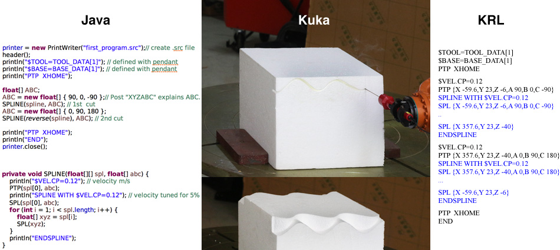
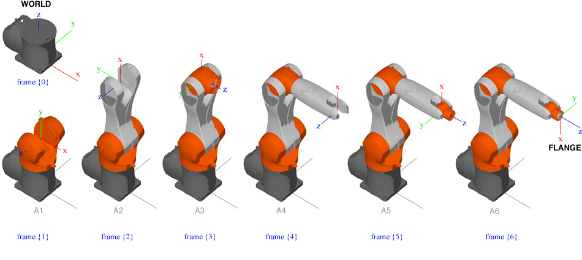

# JavaKUKA
Javakuka is an open-source project for creating Kuka Robot Language (KRL) codes in Java. 

Currently the following tools are available:

**LA**: linear algebra.

**Robot**: forward and inverse kinematics.

**KRLwriter** : put geometric data into a .src file.

please visit *http://javakuka.com/* for  details.

The correspondence between the Java codes, the robot, and KRL codes looks like:

